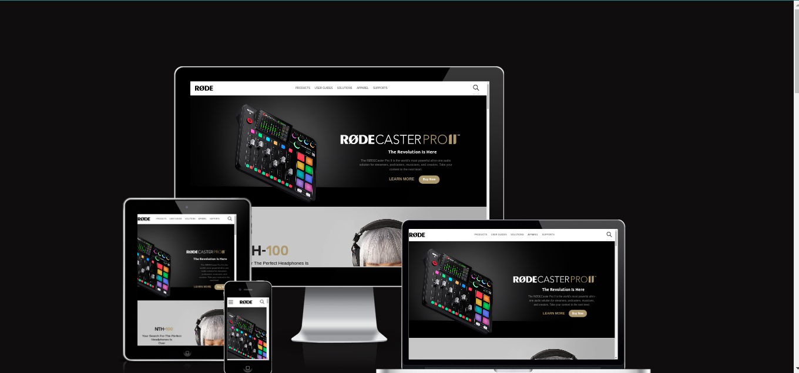
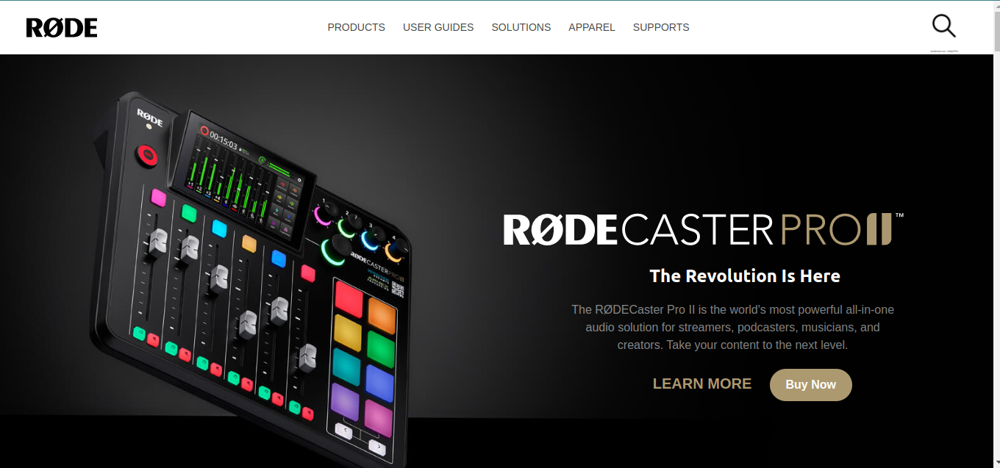
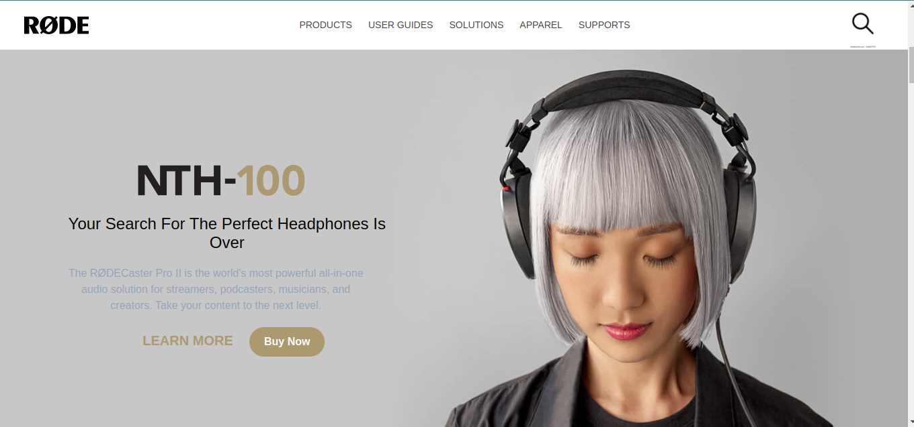
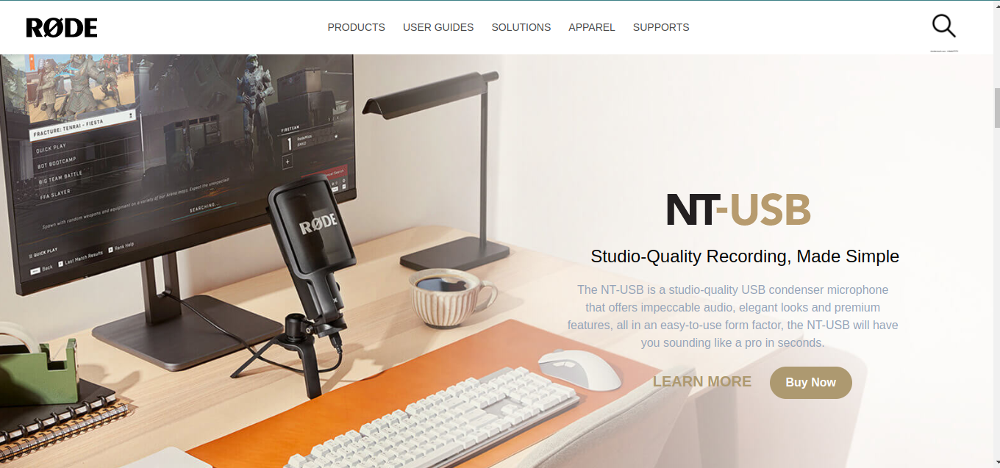
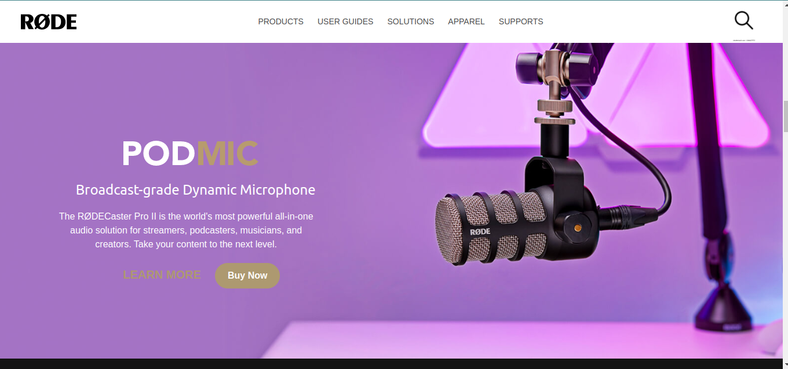
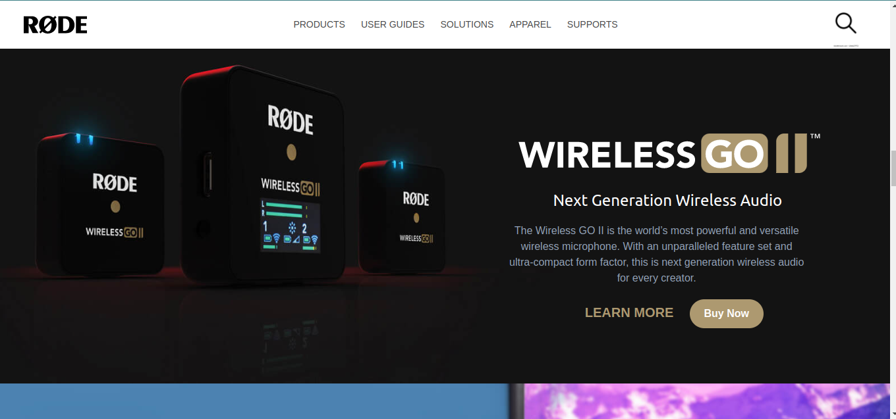
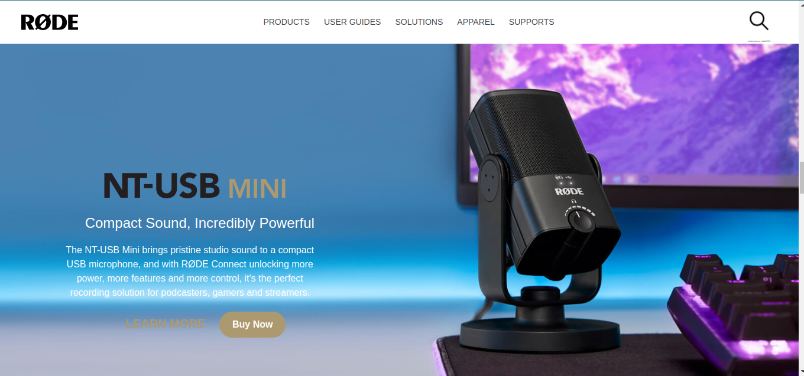
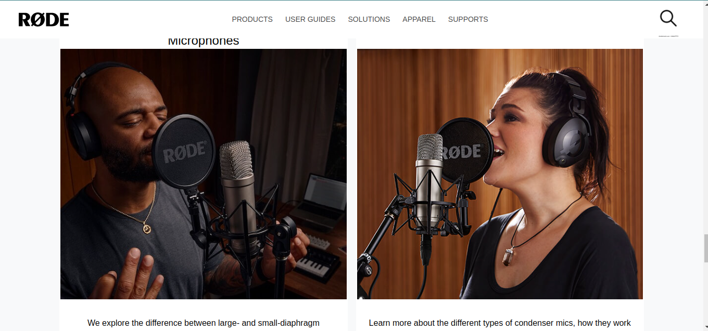
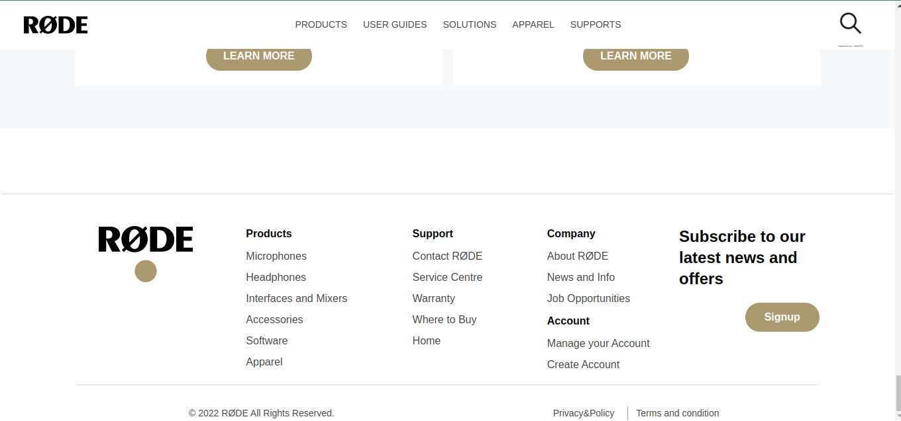

# I am Abhishek Singh
_I am learning Full stack javascript Development_

## This is the assignment that is the part of our live course.

### This is my third Tailwind project

### What I did in this project ?
 ## Navbar
_I made navbar section using felx and on small screen sizes i have used hidden class to hide the anchor tag and i used hamburger icon on medium screen sizes this will be hidden and on small screen size this willl be visible._

## Section - 
_In all section i have used background image and learned all prorperty how to add background image in tailwind and some class i have used background repeat and background-size in all section but in medium screen size and wider screen the imgae will be deifferent and small screen size the anothe image will be visible._

# Challening part for me 
_Image should be different in medium and wider screen size and in small screen size the image will be different._

# This is Responsive in all screen sizes.

# Tailwind Project
1. Rode Clone

# Technology used:
1. ```HTML5```
1. ```Tailwind CSS```

# Deployed Link
[Netlify Link](https://rode-clone-website.netlify.app/)












# Time Taken To Complete This project

_10hours_